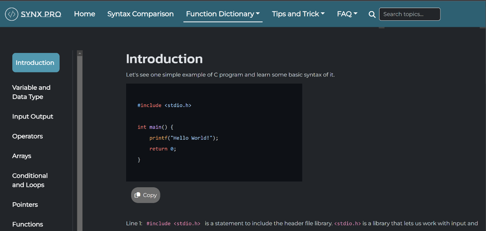

# Final Project HCI - Synx Pro

**Team:** return 0;

**Class:** L1AC

**Members:**
- Ella Raputri (2702298154)
- Ellis Raputri (2702298116)

**Live link:** [Click here](https://ellisraputri.github.io/Final_Project_HCI-Synx_Pro/)

**Report, Demo Video, Presentation Slide:** [Click here](https://drive.google.com/drive/folders/1IHjztGVOHBchNvN1FTIj-T-0Tbu-i_NA?usp=sharing)

 

## Project Description
Synx Pro is a website that helps beginner programmers learn about new programming languages. Synx Pro provides four main features to familiarize beginner programmers with the programming languages they want to learn. The main features are function dictionaries, syntax comparison, tips and tricks, and FAQs. For now, Synx Pro also only has the programming languages C, C++, and Python. Besides them, there is also the home page that functions as the landing page for users when they open Synx Pro for the first time.

 

## Contents

&ensp;<b>Home Page</b>

- The Home Page is a landing page for users when accessing Synx Pro. 

- _Unique features:_
    - Intro page before the main content
    - Color-changing logo and animated cover image.
    - Short introduction of Synx Pro's features
    - Button that link to all Synx Pro's features
    - Short history of each programming language with a swipeable cube moving images.
    - Contact us form 

- Here are some images of this page:

   

   

   

  

 

&ensp;<b>Syntax Comparison</b>

- Syntax Comparison as stated in its name is used to compare one programming language’s syntax to another programming language’s syntax.

- _Unique features:_
    - Comparing topics across programming languages provided (C, C++, Python) 
    - Link to the related topic's function dictionary.

- _Topics provided for syntax comparing:_
    - Basic Syntax
    - Variable and Data Type (Data Type, Variable Name, Creating Variable, Implicit Conversion, Explicit Conversion, and Variable Scope)
    - Input and Output (Output, Input, Comments, Escape Sequences, and Exception Handling)
    - Operators (Arithmetic Operators, Assignment Operators, Comparison Operators, Logical Operators, Identity Operators, Membership Operators, and Bitwise Operators)
    - Arrays (Define an Array, Access Array Elements, Size of an Array, Declare a Structure, String Concatenation, Access String Elements, and Length of a String)
    - Conditional (If Else Else If and Switch Case)
    - Loops (While and For)
    - Pointers (Memory Address, Declaring Pointer, Printing with Pointer, Pointer of Array, and References)
    - Function (Create Function, Call a Function, Arguments, and Lambda)
    - Classes (Create Class, Create Object, Create Method, Constructors, Encapsulation, Inheritance, and Polymorphism)
    - File Handling (Read File, Create File, Write to a File, and Append to a File)

- Here are some images of this page:

   

  

 

&ensp;<b>Function Dictionary</b>

- Function Dictionary is a feature that explains basic topics of a programming language. Each programming language has its own function dictionary. 

- _Unique features:_
    - Side navigation bar for each programming language
    - Topic explanations with copyable code snippets
    - Highlighted code snippets
    - Table of contents with a link to the subtopic
    - Back to top button
    - External link to module's documentation
    - Previewable and downloadable cheatsheet

- _Topics for Each Programming Language:_
    - C (Introduction, Variable and Data Type, Input Output, Operators, Arrays, Conditional and Loops, Pointers, Functions, Modules, File Handling, and Cheat Sheet)
    - C++ (Introduction, Variable and Data Type, Input Output, Operators, Arrays, Conditional and Loops, Pointers, Functions, Classes, Modules, File Handling, and Cheat Sheet)
    - Python (Introduction, Variable and Data Type, Input Output, Operators, Arrays, Conditional and Loops, Functions, Classes, Modules, File Handling, and Cheat Sheet)

- Here are some images of this page:

   

  

 

&ensp;<b>Tips and Tricks</b>

- Tips and Tricks is a page that consists of tips and tricks for users when studying a particular programming language. Same with the function dictionary, each programming language has its own tips and tricks page.

- _Unique features:_
  - Tips and tricks flash cards.
  - Swipeable tips and tricks videos and link to the videos.
  - Swipeable course videos and link to the videos.

- Here are some images of this page:

   

  

 

&ensp;<b>FAQ</b>

- FAQ is a feature that contains interactive accordions about a beginner’s commonly asked questions about the respective programming language.  

- _Unique features:_
    - Clickable and interactive accordion bars.

- Here are some images of this page:

  

 

## Files

&ensp;<b>HTML Files</b>

- **index.html**: homepage
- **faq_c.html**: FAQ for C Programming Language
- **faq_cpp.html**: FAQ for C++ Programming Language
- **faq_py.html**: FAQ for Python Programming Language
- **fd_c_(...).html**: Function Dictionary for C with the topic based on the (...)
- **fd_cpp_(...).html**: Function Dictionary for C++ with the topic based on the (...)
- **fd_py_(...).html**: Function Dictionary for Python with the topic based on the (...)
- **syntaxcomp.html**: Syntax Comparison Page
- **tips_c.html**: Tips and Tricks for C Programming Language
- **tips_cpp.html**: Tips and Tricks for C++ Programming Language
- **tips_py.html**: Tips and Tricks for Python Programming Language

 

&ensp;<b>CSS Files</b>

- **styles.css**: styling for homepage
- **stylefaq.css**: styling for FAQ Pages
- **stylefundict.css**: styling for Function Dictionary
- **stylehome.css**: styling for introduction pages in Function Dictionary
- **stylesyncomp.css**: styling for Syntax Comparison page
- **styletips.css**: styling for Tips and Tricks pages
- **aos.css**: required for the animation of scroll effects

 

&ensp;<b>Javascript Files</b>

- **aos.js**: required for the animation of scroll effects
- **faq.js**: Javascript for FAQ pages
- **funcdict.js**: Javascript for Function Dictionary Pages
- **index.js**: Javascript for homepage
- **syncomp.js**: Javascript for Syntax Comparison page
- **tips.js**: Javascript for Tips and Tricks pages

 

## External Source Used

- **[Bootstrap](https://getbootstrap.com/docs/5.3/getting-started/introduction/)**: main framework for styling 
- **[SwiperJS](https://swiperjs.com/)** : images and videos slider
- **[Aos JS](https://github.com/michalsnik/aos)**: animation on scroll effects
- **[Highlight JS](https://highlightjs.org/)**: highlighting code snippets
- **[jQuery UI](https://jqueryui.com/)**: flip animations

 

## Contact Information

If you have any questions or feedback, please kindly contact us:
- Instagram: [Click here](https://instagram.com/raputriella?igshid=OGQ5ZDc2ODk2ZA==)
- Whatsapp: [Click here](https://wa.me/62895629504490)
- Phone number: +62895629504490